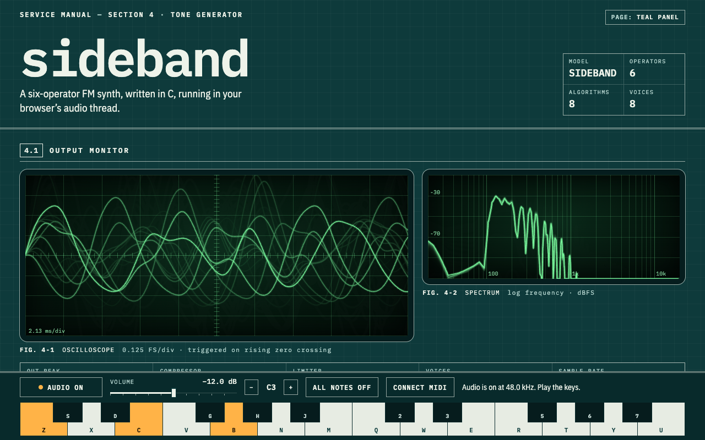

# sideband

**A six-operator FM synth, written in C, running in your browser's audio thread.**

**Live:** https://sideband-3ds.pages.dev

sideband is made in the tradition of 1980s six-operator FM synths. The name comes from FM itself: when one operator modulates another, new partials called *sidebands* appear either side of the carrier, and that is where every tone here comes from. It is dressed as a page from a 1983 service manual: a teal panel with white silkscreen (or, in the light theme, the printed manual page itself), operators drawn as schematic blocks, algorithms drawn as line diagrams, and a phosphor-green oscilloscope with real persistence.



## The 30-second experience

1. Press **START AUDIO** (or just play a key: a key press counts as the gesture browsers require before making sound).
2. Play two octaves on the computer keyboard: `Z`–`M` with `S D G H J` for the black keys, and `Q`–`U` with `2 3 5 6 7`. `-` and `=` shift the octave. The on-screen keys work with mouse and touch, and **CONNECT MIDI** listens to a MIDI keyboard where the browser offers Web MIDI.
3. Pick a factory voice: **E.PIANO, BELL, BASS, BRASS, PAD, MALLET**.
4. Change the **algorithm** (how the six operators are wired), the **feedback**, or any operator's frequency, level and four-stage envelope. The scope and spectrum show the result as you play.
5. **Copy the link.** The whole voice rides in the URL fragment, so any sound is a link.

## What's inside

| Part | File | What it does |
|---|---|---|
| DSP engine | `src/sideband.c`, `src/dspmath.h` | Freestanding C11. 8 voices × 6 operators, 8 algorithms, feedback on OP6, 4-stage envelopes, per-sample smoothing of every edit, voice allocation, DC blocker, RMS compressor, peak limiter, volume, hard ceiling. |
| Audio thread | `web/js/worklet.js` | An `AudioWorkletProcessor` that owns the WASM instance, applies messages between blocks and copies each 128-sample block out. |
| Page | `web/js/*.js`, `web/index.html`, `web/styles.css` | UI only: panel, faders, diagrams, scope/spectrum drawing, keyboard, MIDI, link encoding. No DSP. |
| Tests | `tests/c/test_sideband.c`, `tests/*.test.mjs` | C unit tests, JS tests, an offline WASM render in Node, and a headless-browser check. |

**The synthesis.** Each operator is a sine oscillator (a 4096-point table with linear interpolation, built at start-up from a Taylor series) with a 32-bit phase accumulator. Its frequency is a ratio of the key (coarse 0.5, 1–31 × (1 + fine/100)) or fixed (1 Hz to about 9.8 kHz), plus up to ±20 cents of detune. A modulator's output shifts the phase of the operator below it: a full-level modulator deviates the phase by two turns. Levels step 0.75 dB. Envelope rates run from 40 s (0) to 1.5 ms (99) for a full 0–99 sweep; falling segments are straight lines in dB, and rising ones ease in towards the top so slow attacks land without a tick. Feedback feeds the average of OP6's last two samples back into itself. An operator that would sit near or above Nyquist fades out between 0.43 and 0.47 of the sample rate instead of ringing as an aliased tone.

**Nothing steps.** Every edit made while a note sounds is smoothed per sample: operator levels through two 10 ms one-pole stages, frequencies (ratio, fine, fixed, detune) through a 15 ms glide, velocity and volume likewise. Changing the algorithm under a held note crossfades the two routings over 10 ms. ALL NOTES OFF fades every voice out over 5 ms, a drone played again while it fades out comes back up from where it is, and pausing lets release tails finish before the audio context is suspended.

**The algorithms** (numbering is sideband's own):

| # | Name | Wiring | Carriers |
|---|---|---|---|
| 1 | PAIRS | 2→1, 4→3, 6→5 | 1 3 5 |
| 2 | TWIN STACKS | 3→2→1, 6→5→4 | 1 4 |
| 3 | PAIR + FOUR | 2→1, 6→5→4→3 | 1 3 |
| 4 | TOWER | 6→5→4→3→2→1 | 1 |
| 5 | FAN | 2→1, 6→(3, 4, 5) | 1 3 4 5 |
| 6 | BRANCH | (2, 4→3, 6→5)→1 | 1 |
| 7 | STACK + SINES | 6→5→4, with 1 2 3 plain | 1 2 3 4 |
| 8 | ORGAN | none | all six |

Carriers are mixed at 1/√(number of carriers), so switching algorithms keeps roughly the same loudness.

## Why C

C is the native language of synth firmware and DSP libraries, and it fits the audio thread's rules: the inner loop must be deterministic and must never allocate. The engine is freestanding C11, with no libc, no libm and no heap. Every buffer is static, so `sideband_render()` touches no allocator, takes no locks, and always does bounded work (8 voices × 6 operators × 128 samples, with twice the sine lookups during a 10 ms algorithm crossfade). The maths it needs (a sine table, `exp2` and `log2`) is written in the file.

`zig cc -target wasm32-freestanding -nostdlib` compiles it to a self-contained WebAssembly module (no imports; the build fails if it would need any) with a fixed 256 KiB memory that can never grow. The same C file compiles natively for the unit tests, and both builds produce **bit-identical samples** for the same patch and notes: the C tests and the Node render test pin the same golden hash.

## Hearing safety

- A slow RMS compressor with a wide soft knee sits before the limiter. One note of a factory voice loses at most 2.3 dB (at the E.PIANO attack); dense chords and extreme patches are pulled down, so turning the volume up for a quiet voice does not make a dense one jump out (measured below).
- A peak limiter with instant attack holds the synth at or below −3 dBFS.
- After the volume control, a hard ceiling clamps at −1 dBFS. Output never reaches 0 dBFS.
- Non-finite samples (which clamped parameters should never produce; the fuzz tests check) silence every voice at once.
- Volume starts at −12 dB and glides in from silence. It is not saved between visits and is never part of a link.
- Every value in a link is checked and clamped in the page, and again in the C engine.
- A released note always ends: if an envelope settles above silence, the voice fades out.
- ALL NOTES OFF fades out over 5 ms rather than cutting, and pausing lets notes ring out (up to a second) before the context is suspended.
- The **OUT PEAK**, **COMPRESSOR** and **LIMITER** readouts are measured on the audio thread, not estimated.

All of this is tested; see below.

**Loudness, measured** (loudest 100 ms of the audible band at the default −12 dB volume, offline render of `dist/sideband.wasm`): one note of each factory voice lands between −31.0 and −25.6 dBFS, and the loudest of 300 random or extreme 8-note patches reaches −20.3 dBFS, 6.7 dB above the median voice. The build before the compressor measured −37.0 to −30.4 dBFS for the voices and a 14.2 dB gap. `tests/render.test.mjs` keeps the gap under 9 dB.

## Share links

`#p=1.<107 characters>&n=<name>`: format version 1, the 80 parameters as base64url bytes (value minus minimum), and an optional name (A–Z, 0–9, space, `. - + /`, up to 16 characters). Decoding is bounded: a link over 300 characters is refused before parsing, the body must be exactly 107 characters from the base64url alphabet, and each value is clamped to its range. A bad link gets a plain-English message and loads E.PIANO instead; a link with out-of-range values loads with a note saying how many were clamped. The fragment never reaches a server.

## Build and test

Needs **Zig 0.16** (for `zig cc`) and **Node 20+**. The browser test needs Google Chrome or Chromium (set `CHROME_PATH` if it is not in a standard place; without it that test is skipped, and `REQUIRE_BROWSER=1` makes a missing browser a failure). There are no npm dependencies.

```sh
npm run build   # compiles src/sideband.c to dist/sideband.wasm and copies web/ into dist/
npm test        # C unit tests (UBSan build and -O2 build), build, then all JS tests
npm run serve   # serves dist/ on a random free port with the production headers
npm run bench   # times the engine in Node on this machine
```

What the tests cover:

- **C unit tests** (`tests/c/test_sideband.c`, run by `scripts/test-c.mjs` twice: with trapping UndefinedBehaviorSanitizer, and at `-O2`):
  - sine table, `exp2` and `log2` accuracy against libm;
  - operator frequency maths, and measured pitch of rendered notes;
  - envelope stage timings, the eased attack, rate extremes (including 40 s at 384 kHz), and that envelopes stay in range under live edits;
  - operators fading out near Nyquist (a carrier at 67 kHz is silent, not pinned at 23.5 kHz);
  - smoothing: a level edit moves under a tenth of the way in the first block and lands exactly; a ratio edit glides and lands on the exact increment; an algorithm change crossfades (no step larger than either sound makes on its own, and a change mid-crossfade waits); panic fades over 5 ms without a step; a drone played again mid-fade comes back up without a step;
  - the compressor leaves a quiet note alone, pulls an 8-note chord down by more than 6 dB, never adds gain, and keeps louder input louder;
  - pitch at 384 kHz;
  - algorithm tables against independently written graphs, the OP6-to-OP1 evaluation order, only carriers being audible, and modulation reaching a carrier exactly when the graph has a path;
  - modulation and feedback adding harmonics;
  - the limiter and ceiling under extreme patches and under ±1e6, ±Inf and NaN fed straight into the master chain;
  - volume clamping and fade-in, parameter clamping, voice allocation and stealing, drones that still end;
  - determinism and the golden hash;
  - a fuzz run of 600 random patches (including NaN, Inf and out-of-range values) with random notes and sample rates up to 384 kHz: no NaN/Inf, nothing over the ceiling, compressor gain always in (0, 1].
- **JS tests** (`node --test`):
  - link round trips, clamping, and hostile links (22,000 random or malformed links, all bounded and safe); name cleaning; MIDI parsing;
  - offline render of the real `dist/sideband.wasm` in Node: JS and C parameter specs agree, the drawn algorithms match the compiled routing, the golden hash matches the native build, A4 peaks at 440 Hz, every preset peaks on its key and stays under the ceiling, BASS keeps harmonics 2–5 within 12 dB of its fundamental, hostile patches at full volume stay under the ceiling, the loudness gap above, and a simulated fader drag (−47.8 dB of zipper sidebands; stepping once per block measured −21.6 dB);
  - `dist/` contents, headers and CSP, THIRD-PARTY-NOTICES, no bare deploy scripts;
  - WCAG AA contrast for every text colour pairing in both themes;
  - headless Chrome (audio muted): no console errors at 1280 px and at a true 400 px phone width (device emulation), both themes, reduced motion; keyboard focus never lands behind the fixed dock at either width; Start runs the worklet (its meter messages prove the C engine is rendering); keys play; links clamp or fail politely; MIDI denial is handled; and, under the strict autoplay policy (`--autoplay-policy=document-user-activation-required`) with touch emulation, the very first tap on a key unlocks the audio and plays that note.

The browser test proves the audio graph runs and meters; it cannot prove what a speaker plays, because the audio is muted in headless Chrome.

## Cloudflare (free tier)

sideband is a static site: `dist/` is about 120 KB in 16 files, all served as Cloudflare Pages static assets (free, unlimited requests, 20,000 files and 25 MiB per file). There is no Worker and no server logic; the DSP runs in the visitor's browser. `wrangler.toml` sets `pages_build_output_dir = "dist"` and carries no account id.

`dist/_headers` sets a strict Content-Security-Policy (`script-src 'self' 'wasm-unsafe-eval'`, no inline code), and `Cache-Control: no-cache` so browsers revalidate the unhashed files instead of caching them for long. SharedArrayBuffer is not used, so no cross-origin isolation headers are needed.

For readers, the plain command would be `wrangler pages deploy dist --project-name sideband`. The owner deploys through a guarded script instead, so the repo contains no deploy script.

## Honest limitations

- The presets were shaped by measuring offline renders (spectra, decay times, levels), then adjusted; they are starting points, not copies of any instrument.
- Velocity scales the whole voice (0.3 + 0.7 × velocity/127). There is no per-operator velocity sensitivity, no LFO, no pitch envelope, no keyboard scaling, no sustain pedal.
- The algorithms and envelope curves are sideband's own; it does not load patches from any other synth.
- Operators fade out before Nyquist, but there is no oversampling, so a bright patch's FM sidebands can still fold back on high notes (BELL at C7, for example).
- Notes and edits arrive between 128-sample blocks (about 2.7 ms at 48 kHz); edits then glide in per sample.
- A stolen voice keeps its phase to avoid a click and jumps to its new pitch; voice stealing is not crossfaded.
- On touch screens a browser only lets audio start when a finger lifts, so the very first tap sounds on release (it is queued, not lost).
- The engine runs at 8 to 384 kHz; an audio device outside that range gets a clear message instead of an out-of-tune synth.
- The C engine allocates nothing, and neither does the worklet's `process()`: samples are copied with plain loops, and the meter message reuses one object (`postMessage` still copies it, about 20 times a second).
- Tested in headless Chrome only. Other browsers with AudioWorklet should work but have not been checked.
- The page loads IBM Plex from Google Fonts; everything else is same-origin.
- On narrow screens the MIDI button is hidden and the routine status line is visually hidden (errors still show) to keep the dock compact.

## Next

- A patch bank on Workers KV (save and name voices; the free tier allows 100k reads and 1k writes a day).
- Velocity curves and per-operator velocity sensitivity.
- LFO, pitch envelope, keyboard level and rate scaling, sustain pedal.
- Optional 2× oversampling.
- Crossfaded voice stealing.

## Third-party notices

No third-party code is compiled or bundled into `dist/`. The fonts are loaded from Google Fonts and are not copied into the site. [`web/THIRD-PARTY-NOTICES.txt`](web/THIRD-PARTY-NOTICES.txt) (shipped as `dist/THIRD-PARTY-NOTICES.txt` and linked from the page) records this, with the fonts' licence (SIL Open Font License 1.1).

## Credits

Built by Ramen Protocol with AI assistance (Claude). MIT licensed; see `LICENSE`.
